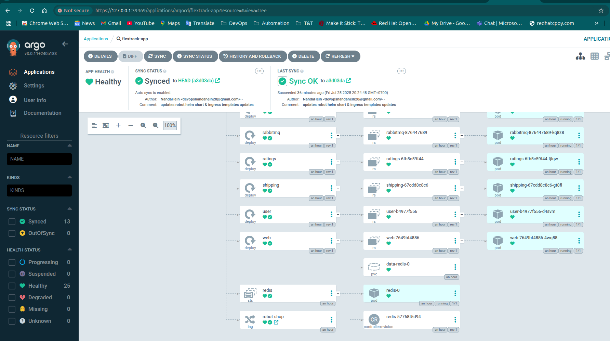
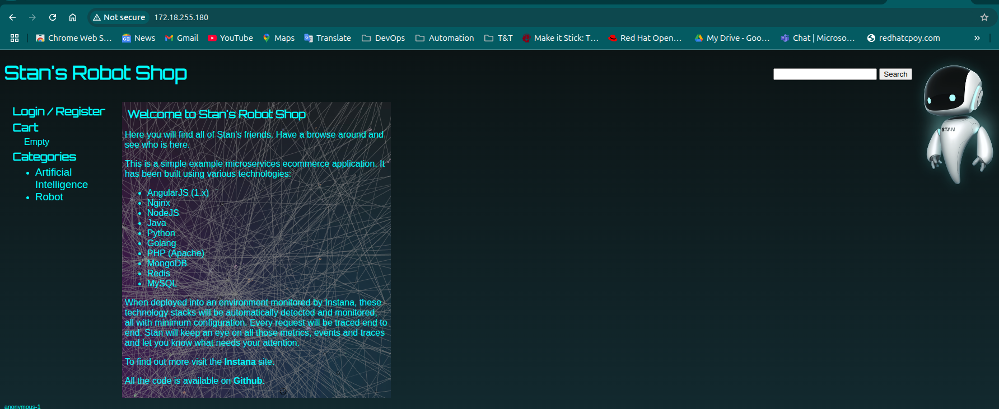
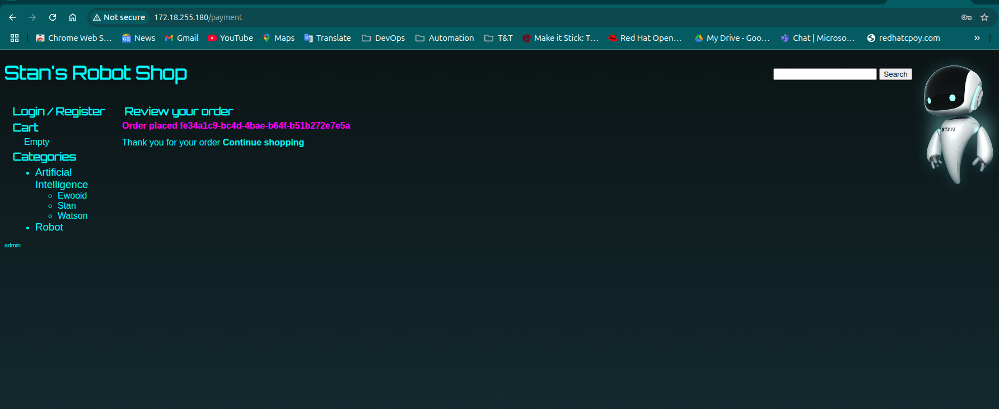
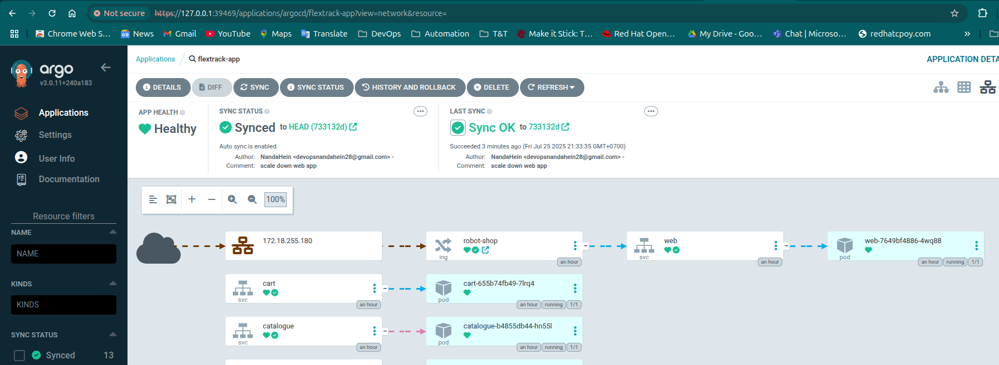
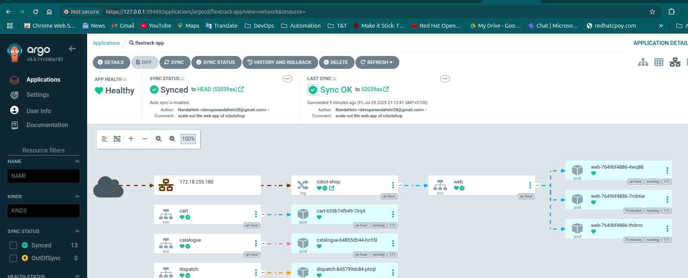

# Robot Shop Microservices Deployment with ArgoCD and Helm

This repository provides a Terraform-based infrastructure setup to deploy the `robot-shop` microservices on a local Kubernetes cluster using ArgoCD for GitOps and the NGINX Ingress Controller for external access. The configuration automates the deployment of ArgoCD, the NGINX Ingress Controller, and the `robot-shop` microservices, which are defined in a Helm chart stored in the `robot-shop` directory. The microservices include components such as `cart`, `catalogue`, `dispatch`, `mongodb`, `mysql`, `payment`, `rabbitmq`, `ratings`, `redis`, `shipping`, `user`, and `web`.

## Table of Contents
- [Overview](#overview)
- [Prerequisites](#prerequisites)
- [Repository Structure](#repository-structure)
- [Setup Instructions](#setup-instructions)
  - [Prepare the Local Kubernetes Cluster](#prepare-the-local-kubernetes-cluster)
  - [Clone the Repository](#clone-the-repository)
  - [Apply Terraform Configuration](#apply-terraform-configuration)
- [Verification](#verification)
  - [Check ArgoCD Deployment](#check-argocd-deployment)
  - [Check Robot Shop Microservices](#check-robot-shop-microservices)
  - [Check NGINX Ingress Controller](#check-nginx-ingress-controller)
  - [Check Ingress](#check-ingress)
- [Accessing the Application](#accessing-the-application)
  - [ArgoCD UI](#argocd-ui)
  - [Microservices via Ingress](#microservices-via-ingress)
- [Managing the Deployment](#managing-the-deployment)
  - [Updating Microservices](#updating-microservices)
- [Contributing](#contributing)
- [License](#license)

## Overview
This project uses Terraform to:
- Deploy ArgoCD in the `argocd` namespace to manage Kubernetes resources via GitOps.
- Install the NGINX Ingress Controller in the `ingress-nginx` namespace to handle external traffic.
- Configure an ArgoCD `Application` to deploy the `robot-shop` microservices using a Helm chart stored in the `robot-shop` directory of this repository (`https://github.com/cloudhein/cluster.git`).
- Define an Ingress resource in the Helm chart to route traffic to the `web` service of the `robot-shop` application.

The `robot-shop` microservices are managed by ArgoCD, ensuring the cluster state matches the Git repository’s Helm chart configuration.

## Prerequisites
- **Local Kubernetes Cluster**: Minikube, Kind, or Docker Desktop Kubernetes. Verify with `kubectl cluster-info`.
- **kubectl**: Installed and configured with `~/.kube/config` for cluster access.
- **Terraform**: must be installed.
- **Git**: Installed for cloning the repository and managing the Helm chart.
- **Helm CLI**: Optional, for debugging Helm chart installations.
- **GitHub Repository**: Ensure the `robot-shop` directory in `https://github.com/cloudhein/cluster.git` contains a valid Helm chart with `Chart.yaml`, `values.yaml`, and `templates/ingress.yaml`.

## Repository Structure
```
├── config/
│   └── application.yaml.tmpl  # ArgoCD Application template
├── argocd.tf                  # ArgoCD Helm release
├── ingress-controller.tf      # NGINX Ingress Controller Helm release
├── locals.tf                  # Local variables for ArgoCD apps
├── microservice.tf            # ArgoCD Application resource
├── variables.tf               # Variable definitions
├── terraform.tfvars           # Variable values
└── versions.tf                # Provider configurations
```

## Setup Instructions

### Prepare the Local Kubernetes Cluster
1. Start your local Kubernetes cluster:
   ```bash
   minikube start  # For Minikube
   # or
   kind create cluster  # For Kind
   ```
2. Verify cluster access:
   ```bash
   kubectl cluster-info
   ```

### Clone the Repository
```bash
git clone https://github.com/cloudhein/cluster.git
cd cluster
```

### Apply Terraform Configuration
1. Initialize Terraform:
   ```bash
   terraform init
   ```
   This downloads the required providers (`hashicorp/helm`, `gavinbunney/kubectl`).
2. Format the configuration:
   ```bash
   terraform fmt
   ```
3. Plan the deployment:
   ```bash
   terraform plan
   ```
4. Apply the configuration:
   ```bash
   terraform apply -auto-approve
   ```

This deploys:
- ArgoCD in the `argocd` namespace.
- NGINX Ingress Controller in the `ingress-nginx` namespace.
- An ArgoCD `Application` named `robot-shop`, syncing the Helm chart from the `robot-shop` directory.

## Verification
Use the following commands to verify the deployment, as shown in the draft notes.

### Check ArgoCD Deployment
```bash
kubectl get all -n argocd
```
**Expected Output**:
```
NAME                                                    READY   STATUS    RESTARTS   AGE
pod/argocd-application-controller-0                     1/1     Running   0          65m
pod/argocd-applicationset-controller-687dc9b464-5btkm   1/1     Running   0          65m
pod/argocd-dex-server-6677fcf5f-v5gmp                   1/1     Running   0          65m
pod/argocd-notifications-controller-7678fcb469-smwgx    1/1     Running   0          65m
pod/argocd-redis-5895d6f4f5-5rwlc                       1/1     Running   0          65m
pod/argocd-repo-server-6f7fd77494-hdgt6                 1/1     Running   0          65m
pod/argocd-server-89b45ffb4-zptpx                       1/1     Running   0          65m

NAME                                       TYPE        CLUSTER-IP       EXTERNAL-IP   PORT(S)             AGE
service/argocd-applicationset-controller   ClusterIP   10.132.191.200   <none>        7000/TCP            65m
service/argocd-dex-server                  ClusterIP   10.132.240.54    <none>        5556/TCP,5557/TCP   65m
service/argocd-redis                       ClusterIP   10.132.83.63     <none>        6379/TCP            65m
service/argocd-repo-server                 ClusterIP   10.132.44.16     <none>        8081/TCP            65m
service/argocd-server                      ClusterIP   10.132.191.129   <none>        80/TCP,443/TCP      65m

NAME                                               READY   UP-TO-DATE   AVAILABLE   AGE
deployment.apps/argocd-applicationset-controller   1/1     1            1           65m
deployment.apps/argocd-dex-server                  1/1     1            1           65m
deployment.apps/argocd-notifications-controller    1/1     1            1           65m
deployment.apps/argocd-redis                       1/1     1            1           65m
deployment.apps/argocd-repo-server                 1/1     1            1           65m
deployment.apps/argocd-server                      1/1     1            1           65m

NAME                                                          DESIRED   CURRENT   READY   AGE
replicaset.apps/argocd-applicationset-controller-687dc9b464   1         1         1       65m
replicaset.apps/argocd-dex-server-6677fcf5f                   1         1         1       65m
replicaset.apps/argocd-notifications-controller-7678fcb469    1         1         1       65m
replicaset.apps/argocd-redis-5895d6f4f5                       1         1         1       65m
replicaset.apps/argocd-repo-server-6f7fd77494                 1         1         1       65m
replicaset.apps/argocd-server-89b45ffb4                       1         1         1       65m

NAME                                             READY   AGE
statefulset.apps/argocd-application-controller   1/1     65m
```

### Check Robot Shop Microservices
```bash
kubectl get all -n default
```
**Expected Output**:
```
NAME                            READY   STATUS    RESTARTS   AGE
pod/cart-655b74fb49-7lrq4       1/1     Running   0          57m
pod/catalogue-b4855db44-hn55l   1/1     Running   0          57m
pod/dispatch-845799dc84-ptzql   1/1     Running   0          57m
pod/mongodb-69d9cf5747-5229b    1/1     Running   0          57m
pod/mysql-8c599b989-zvfx9       1/1     Running   0          57m
pod/payment-6589fd67f6-xbxbb    1/1     Running   0          57m
pod/rabbitmq-876447689-kq8z8    1/1     Running   0          57m
pod/ratings-6fb5c59f44-fjlqw    1/1     Running   0          57m
pod/redis-0                     1/1     Running   0          57m
pod/shipping-67cdd8c8c6-gt8fl   1/1     Running   0          57m
pod/user-b4977f556-d4svm        1/1     Running   0          57m
pod/web-7649bf4886-4wq88        1/1     Running   0          57m

NAME                 TYPE        CLUSTER-IP       EXTERNAL-IP   PORT(S)                       AGE
service/cart         ClusterIP   10.132.23.156    <none>        8080/TCP                      57m
service/catalogue    ClusterIP   10.132.13.230    <none>        8080/TCP                      57m
service/dispatch     ClusterIP   None             <none>        55555/TCP                     57m
service/kubernetes   ClusterIP   10.132.0.1       <none>        443/TCP                       12h
service/mongodb      ClusterIP   10.132.75.235    <none>        27017/TCP                     57m
service/mysql        ClusterIP   10.132.241.212   <none>        3306/TCP                      57m
service/payment      ClusterIP   10.132.113.144   <none>        8080/TCP                      57m
service/rabbitmq     ClusterIP   10.132.242.192   <none>        5672/TCP,15672/TCP,4369/TCP   57m
service/ratings      ClusterIP   10.132.142.49    <none>        80/TCP                        57m
service/redis        ClusterIP   10.132.17.158    <none>        6379/TCP                      57m
service/shipping     ClusterIP   10.132.111.137   <none>        8080/TCP                      57m
service/user         ClusterIP   10.132.147.116   <none>        8080/TCP                      57m
service/web          NodePort    10.132.141.15    <none>        8080:30491/TCP                57m

NAME                        READY   UP-TO-DATE   AVAILABLE   AGE
deployment.apps/cart        1/1     1            1           57m
deployment.apps/catalogue   1/1     1            1           57m
deployment.apps/dispatch    1/1     1            1           57m
deployment.apps/mongodb     1/1     1            1           57m
deployment.apps/mysql       1/1     1            1           57m
deployment.apps/payment     1/1     1            1           57m
deployment.apps/rabbitmq    1/1     1            1           57m
deployment.apps/ratings     1/1     1            1           57m
deployment.apps/shipping    1/1     1            1           57m
deployment.apps/user        1/1     1            1           57m
deployment.apps/web         1/1     1            1           57m

NAME                                  DESIRED   CURRENT   READY   AGE
replicaset.apps/cart-655b74fb49       1         1         1       57m
replicaset.apps/catalogue-b4855db44   1         1         1       57m
replicaset.apps/dispatch-845799dc84   1         1         1       57m
replicaset.apps/mongodb-69d9cf5747    1         1         1       57m
replicaset.apps/mysql-8c599b989       1         1         1       57m
replicaset.apps/payment-6589fd67f6    1         1         1       57m
replicaset.apps/rabbitmq-876447689    1         1         1       57m
replicaset.apps/ratings-6fb5c59f44    1         1         1       57m
replicaset.apps/shipping-67cdd8c8c6   1         1         1       57m
replicaset.apps/user-b4977f556        1         1         1       57m
replicaset.apps/web-7649bf4886        1         1         1       57m

NAME                     READY   AGE
statefulset.apps/redis   1/1     57m
```

### Check NGINX Ingress Controller
```bash
kubectl get all -n ingress-nginx
```
**Expected Output**:
```
NAME                                                          READY   STATUS    RESTARTS   AGE
pod/nginx-ingress-ingress-nginx-controller-7bd769587f-r7s4q   1/1     Running   0          63m

NAME                                                       TYPE           CLUSTER-IP       EXTERNAL-IP      PORT(S)                      AGE
service/nginx-ingress-ingress-nginx-controller             LoadBalancer   10.132.19.246    172.18.255.180   80:30862/TCP,443:30286/TCP   63m
service/nginx-ingress-ingress-nginx-controller-admission   ClusterIP      10.132.232.169   <none>           443/TCP                      63m

NAME                                                     READY   UP-TO-DATE   AVAILABLE   AGE
deployment.apps/nginx-ingress-ingress-nginx-controller   1/1     1            1           63m

NAME                                                                DESIRED   CURRENT   READY   AGE
replicaset.apps/nginx-ingress-ingress-nginx-controller-7bd769587f   1         1         1       63m
```

### Check Ingress
```bash
kubectl get ingress -A
```
**Expected Output**:
```
NAMESPACE   NAME         CLASS   HOSTS   ADDRESS          PORTS   AGE
default     robot-shop   nginx   *       172.18.255.180   80      67m
```

## Accessing the Application

### ArgoCD UI
1. Get the ArgoCD admin password:
   ```bash
   kubectl -n argocd get secret argocd-initial-admin-secret -o jsonpath="{.data.password}" | base64 -d
   ```
   **Example Output**: `-z7H5nfdMpCGxVK2`
2. Port-forward to the ArgoCD server:
   ```bash
   kubectl port-forward svc/argocd-server -n argocd 8080:80
   ```
   **Example Output**:
   ```
   Forwarding from 127.0.0.1:39469 -> 8080
   Forwarding from [::1]:39469 -> 8080
   Handling connection for 39469
   ```
3. Open `http://localhost:8080` in a browser, log in with username `admin` and the password.
4. Verify the `robot-shop` application is `Healthy` and `Synced`.



### Microservices via Ingress
1. Get the Ingress address:
   ```bash
   kubectl get ingress -n default
   ```
   **Example Output**: `robot-shop` with address `172.18.255.180`.

##### Access the bot microservices via ingress





## Managing the Deployment

### Updating Microservices
1. Modify the Helm chart in the `robot-shop/` directory (e.g., update `values.yaml` to change `service.port` or add new templates).
2. Commit and push changes:
   ```bash
   git add robot-shop/
   git commit -m "Scale out web app of bot microservices"
   git push origin HEAD
   ```
3. ArgoCD automatically syncs changes (due to `syncPolicy.automated`).
4. Verify in the ArgoCD UI or with:
   ```bash
   argocd app sync robot-shop
   kubectl get pods -n default
   ```
#### Before doing updates



#### After updating microservices (scale out the web app)



## Contributing
Contributions are welcome! Please:
1. Fork the repository.
2. Create a feature branch (`git checkout -b feature/YourFeature`).
3. Commit changes (`git commit -m "Add YourFeature"`).
4. Push to the branch (`git push origin feature/YourFeature`).
5. Open a pull request.

## License
This project is licensed under the MIT License. See the [LICENSE](LICENSE) file for details.