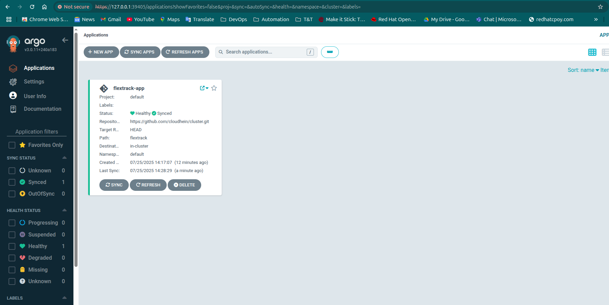
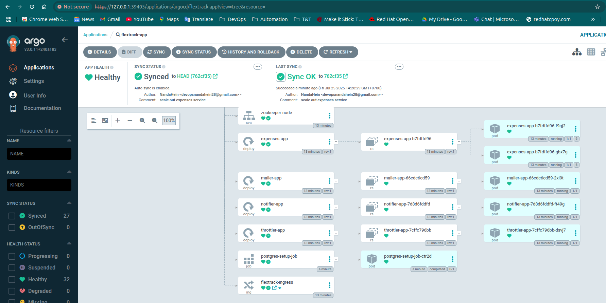
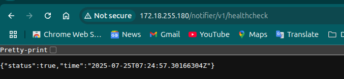
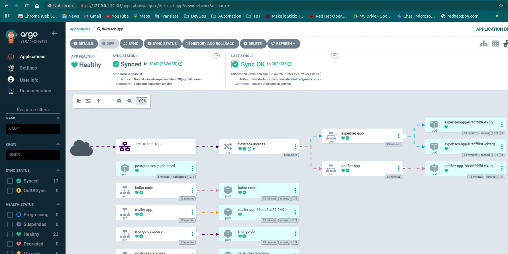
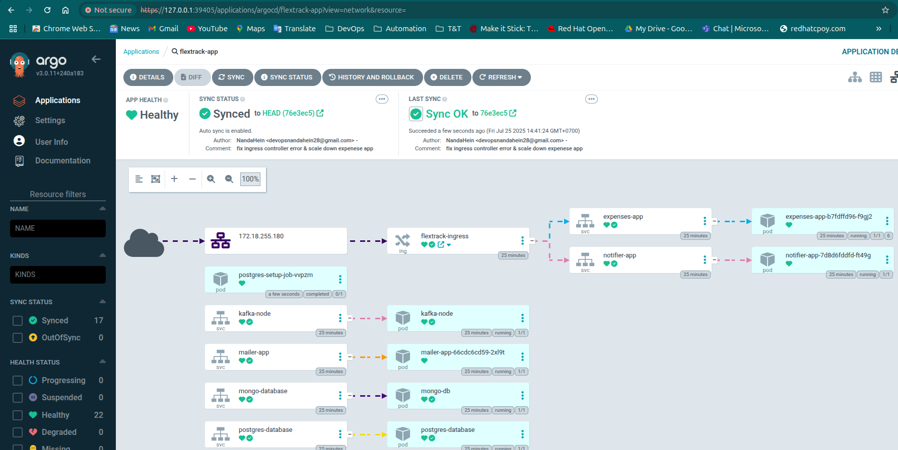

# Flextrack Microservices Deployment with ArgoCD

This repository provides a Terraform-based infrastructure setup to deploy the `flextrack-app` microservices on a local Kubernetes cluster using ArgoCD for GitOps and the NGINX Ingress Controller for external access. The configuration automates the deployment of ArgoCD, the NGINX Ingress Controller, and the `flextrack-app` microservices, which include components such as `expenses-app`, `mailer-app`, `notifier-app`, `throttler-app`, `kafka-node`, `mongo-db`, `postgres-database`, `rabbitmq`, `redis`, and `zookeeper-node`.

## Table of Contents
- [Overview](#overview)
- [Prerequisites](#prerequisites)
- [Repository Structure](#repository-structure)
- [Setup Instructions](#setup-instructions)
  - [Prepare the Local Kubernetes Cluster](#prepare-the-local-kubernetes-cluster)
  - [Clone the Repository](#clone-the-repository)
  - [Apply Terraform Configuration](#apply-terraform-configuration)
- [Verification](#verification)
  - [Check ArgoCD Deployment](#check-argocd-deployment)
  - [Check Flextrack Microservices](#check-flextrack-microservices)
  - [Check NGINX Ingress Controller](#check-nginx-ingress-controller)
  - [Check Ingress](#check-ingress)
- [Accessing the Application](#accessing-the-application)
  - [ArgoCD UI](#argocd-ui)
  - [Microservices via Ingress](#microservices-via-ingress)
- [Managing the Deployment](#managing-the-deployment)
  - [Updating Microservices](#updating-microservices)
- [Contributing](#contributing)
- [License](#license)

## Overview
This project uses Terraform to:
- Deploy ArgoCD in the `argocd` namespace to manage Kubernetes resources via GitOps.
- Install the NGINX Ingress Controller in the `ingress-nginx` namespace to handle external traffic.
- Configure an ArgoCD `Application` named `flextrack-app` to deploy microservices from the `flextrack` directory in this repository (`https://github.com/cloudhein/cluster.git`).
- Configure the NGINX Ingress Controller to support risky annotations with `annotations-risk-level: Critical`.

The `flextrack-app` microservices are defined in Kubernetes manifests stored in the `flextrack` directory, managed by ArgoCD to ensure the cluster state matches the Git repository.

## Prerequisites
- **Local Kubernetes Cluster**: Minikube, Kind, or any K8s Cluster. Verify with `kubectl cluster-info`.
- **kubectl**: Installed and configured with `~/.kube/config` for cluster access.
- **Terraform**: must be installed.
- **Git**: Installed for cloning the repository and managing manifests.
- **Helm CLI**: Optional, for debugging Helm installations.
- **GitHub Repository**: Ensure the `flextrack` directory in `https://github.com/cloudhein/cluster.git` contains valid Kubernetes manifests .

## Repository Structure
```
├── config/
│   └── application.yaml.tmpl  # ArgoCD Application template
├── argocd.tf                  # ArgoCD Helm release
├── ingress-controller.tf      # NGINX Ingress Controller Helm release
├── locals.tf                  # Local variables for ArgoCD apps
├── main.tf                    # ArgoCD Application resource
├── variables.tf               # Variable definitions
├── terraform.tfvars           # Variable values
└── versions.tf                # Provider configurations
```

## Setup Instructions

### Prepare the Local Kubernetes Cluster
1. Start your local Kubernetes cluster:
   ```bash
   minikube start  # For Minikube
   # or
   kind create cluster  # For Kind
   ```
2. Verify cluster access:
   ```bash
   kubectl cluster-info
   ```

### Clone the Repository
```bash
git clone https://github.com/cloudhein/cluster.git
cd cluster
```

### Apply Terraform Configuration
1. Initialize Terraform:
   ```bash
   terraform init
   ```
   This downloads the required providers (`hashicorp/helm`, `gavinbunney/kubectl`).
2. Format the configuration:
   ```bash
   terraform fmt
   ```
3. Plan the deployment:
   ```bash
   terraform plan
   ```
4. Apply the configuration:
   ```bash
   terraform apply -auto-approve
   ```

This deploys:
- ArgoCD in the `argocd` namespace.
- NGINX Ingress Controller in the `ingress-nginx` namespace.
- An ArgoCD `Application` named `flextrack-app`, syncing manifests from the `flextrack` directory.

## Verification
Use the following commands to verify the deployment, as shown in the draft notes.

### Check ArgoCD Deployment
```bash
kubectl get all -n argocd
```
**Expected Output**:
```
NAME                                                    READY   STATUS    RESTARTS   AGE
pod/argocd-application-controller-0                     1/1     Running   0          41m
pod/argocd-applicationset-controller-59dbf8974f-g69xq   1/1     Running   0          41m
pod/argocd-dex-server-9cb68d8fd-b5c79                   1/1     Running   0          41m
pod/argocd-notifications-controller-c4f66cdb8-vj8sp     1/1     Running   0          41m
pod/argocd-redis-f54c87c5b-49rvk                        1/1     Running   0          41m
pod/argocd-repo-server-5f794844c8-d24sq                 1/1     Running   0          41m
pod/argocd-server-588bb68db4-xrn88                      1/1     Running   0          41m

NAME                                       TYPE        CLUSTER-IP       EXTERNAL-IP   PORT(S)             AGE
service/argocd-applicationset-controller   ClusterIP   10.132.219.207   <none>        7000/TCP            41m
service/argocd-dex-server                  ClusterIP   10.132.190.84    <none>        5556/TCP,5557/TCP   41m
service/argocd-redis                       ClusterIP   10.132.208.255   <none>        6379/TCP            41m
service/argocd-repo-server                 ClusterIP   10.132.66.68     <none>        8081/TCP            41m
service/argocd-server                      ClusterIP   10.132.125.186   <none>        80/TCP,443/TCP      41m

NAME                                               READY   UP-TO-DATE   AVAILABLE   AGE
deployment.apps/argocd-applicationset-controller   1/1     1            1           41m
deployment.apps/argocd-dex-server                  1/1     1            1           41m
deployment.apps/argocd-notifications-controller    1/1     1            1           41m
deployment.apps/argocd-redis                       1/1     1            1           41m
deployment.apps/argocd-repo-server                 1/1     1            1           41m
deployment.apps/argocd-server                      1/1     1            1           41m

NAME                                                          DESIRED   CURRENT   READY   AGE
replicaset.apps/argocd-applicationset-controller-59dbf8974f   1         1         1       41m
replicaset.apps/argocd-dex-server-9cb68d8fd                   1         1         1       41m
replicaset.apps/argocd-notifications-controller-789c66b8f     1         1         1       41m
replicaset.apps/argocd-redis-f54c87c5b                        1         1         1       41m
replicaset.apps/nginx-ingress-nginx-nginx-controller-789c66b8f     1         1         1       41m
replicaset.apps/argocd-server-588bb68db4                      1         1         1       41m

NAME                                             READY   AGE
statefulset.apps/argocd-application-controller   1/1     41m
```

### Check Flextrack Microservices
```bash
kubectl get all -n default
```
**Expected Output**:
```
NAME                                 READY   STATUS      RESTARTS      AGE
pod/expenses-app-b7fdffd96-f9gj2     1/1     Running     6 (37m ago)   41m
pod/kafka-node                       1/1     Running     0             41m
pod/mailer-app-66cdc6cd59-2xl9t      1/1     Running     0             41m
pod/mongo-db                         1/1     Running     0             41m
pod/notifier-app-7d8d6fddfd-ft49g    1/1     Running     0             41m
pod/postgres-database                1/1     Running     0             41m
pod/postgres-setup-job-k4dtm         0/1     Completed   0             45s
pod/rabbitmq                         1/1     Running     0             41m
pod/redis                            1/1     Running     0             41m
pod/throttler-app-7cffc796bb-dsvj7   1/1     Running     0             41m
pod/zookeeper-node                   1/1     Running     0             41m

NAME                        TYPE        CLUSTER-IP       EXTERNAL-IP   PORT(S)                        AGE
service/expenses-app        ClusterIP   10.132.248.220   <none>        8080/TCP,50051/TCP             41m
service/kafka-node          ClusterIP   10.132.102.177   <none>        9092/TCP,9093/TCP              41m
service/kubernetes          ClusterIP   10.132.0.1       <none>        443/TCP                        6h28m
service/mailer-app          ClusterIP   10.132.205.53    <none>        8080/TCP                       41m
service/mongo-database      ClusterIP   10.132.14.78     <none>        27017/TCP                      41m
service/notifier-app        ClusterIP   10.132.234.217   <none>        8080/TCP                       41m
service/postgres-database   ClusterIP   10.132.17.4      <none>        5432/TCP                       41m
service/rabbitmq-proxy      ClusterIP   10.132.101.135   <none>        5672/TCP,15672/TCP,15692/TCP   41m
service/redis-database      ClusterIP   10.132.115.11    <none>        6379/TCP                       41m
service/throttler-app       ClusterIP   10.132.17.250    <none>        8080/TCP                       41m
service/zookeeper-node      ClusterIP   10.132.228.145   <none>        2181/TCP                       41m

NAME                            READY   UP-TO-DATE   AVAILABLE   AGE
deployment.apps/expenses-app    1/1     1            1           41m
deployment.apps/mailer-app      1/1     1            1           41m
deployment.apps/notifier-app    1/1     1            1           41m
deployment.apps/throttler-app   1/1     1            1           41m

NAME                                       DESIRED   CURRENT   READY   AGE
replicaset.apps/expenses-app-b7fdffd96     1         1         1       41m
replicaset.apps/mailer-app-66cdc6cd59      1         1         1       41m
replicaset.apps/notifier-app-7d8d6fddfd    1         1         1       41m
replicaset.apps/throttler-app-7cffc796bb   1         1         1       41m

NAME                           STATUS     COMPLETIONS   DURATION   AGE
job.batch/postgres-setup-job   Complete   1/1           16s        45s
```

### Check NGINX Ingress Controller
```bash
kubectl get all -n ingress-nginx
```
**Expected Output**:
```
NAME                                                          READY   STATUS    RESTARTS   AGE
pod/nginx-ingress-ingress-nginx-controller-7ff7d99ff4-vg48f   1/1     Running   0          42m

NAME                                             TYPE           CLUSTER-IP    EXTERNAL-IP      PORT(S)                      AGE
service/nginx-ingress-ingress-nginx-controller   LoadBalancer   10.132.77.3   172.18.255.180   80:30760/TCP,443:31505/TCP   42m

NAME                                                     READY   UP-TO-DATE   AVAILABLE   AGE
deployment.apps/nginx-ingress-ingress-nginx-controller   1/1     1            1           42m

NAME                                                                DESIRED   CURRENT   READY   AGE
replicaset.apps/nginx-ingress-ingress-nginx-controller-7ff7d99ff4   1         1         1       42m
```

### Check Ingress
```bash
kubectl get ingress -n default
```
**Expected Output**:
```
NAME                CLASS   HOSTS   ADDRESS          PORTS   AGE
flextrack-ingress   nginx   *       172.18.255.180   80      44m
```

## Accessing the Application

### ArgoCD UI
1. Get the ArgoCD admin password:
   ```bash
   kubectl -n argocd get secret argocd-initial-admin-secret -o jsonpath="{.data.password}" | base64 -d
   ```
   **Example Output**: `EWKBjiuA65bD9T7`
2. Port-forward to the ArgoCD server:
   ```bash
   kubectl port-forward svc/argocd-server -n argocd 8080:80
   ```
   **Example Output**:
   ```
   Forwarding from 127.0.0.1:39405 -> 8080
   Forwarding from [::1]:39405 -> 8080
   Handling connection for 39405
   ```
3. Open `http://localhost:8080` in a browser, log in with username `admin` and the password.
4. Verify the `flextrack-app` application is `Healthy` and `Synced`.





### Microservices via Ingress
1. Get the Ingress address:
   ```bash
   kubectl get ingress -n default
   ```
   **Example Output**: `flextrack-ingress` with address `172.18.255.180`.
#### Access the expense service via ingress


#### Access the notifier service via ingress


## Managing the Deployment

### Updating Microservices
1. Modify manifests in the `flextrack/` directory (e.g., change replicas in `expenses.yaml`).
2. Commit and push changes:
   ```bash
   git add flextrack/
   git commit -m "Scale in expense microservices"
   git push origin HEAD
   ```
3. ArgoCD automatically syncs changes (due to `syncPolicy.automated`).
4. Verify in the ArgoCD UI or with:
   ```bash
   kubectl get pods -n default
   ```
#### Before doing updates


#### After updating microservices (scale down the expense microservices)



## Contributing
Contributions are welcome! Please:
1. Fork the repository.
2. Create a feature branch (`git checkout -b feature/YourFeature`).
3. Commit changes (`git commit -m "Add YourFeature"`).
4. Push to the branch (`git push origin feature/YourFeature`).
5. Open a pull request.

## License
This project is licensed under the MIT License. See the [LICENSE](LICENSE) file for details.